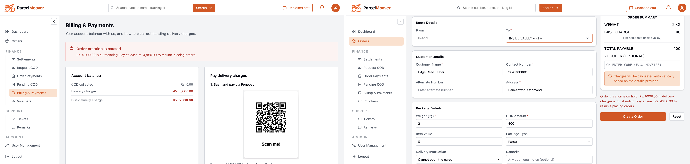
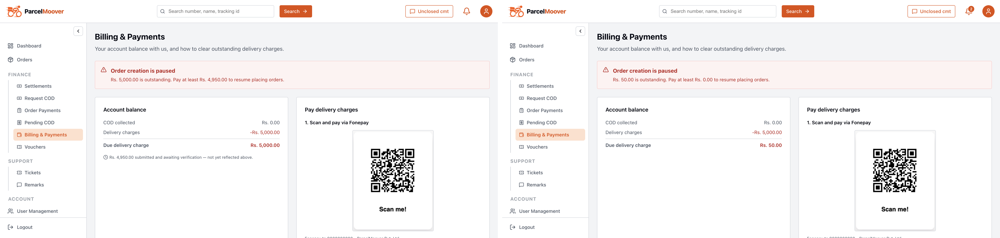
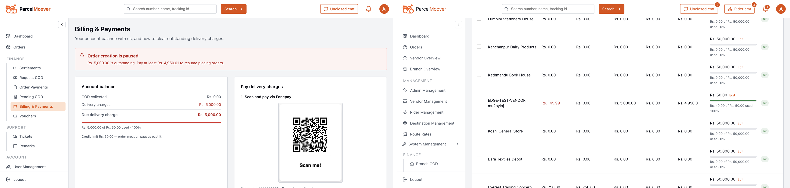
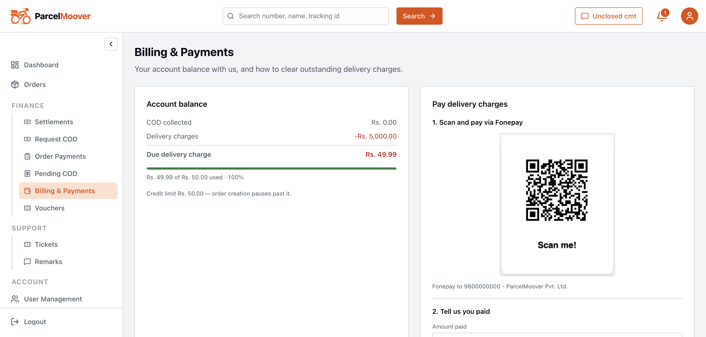
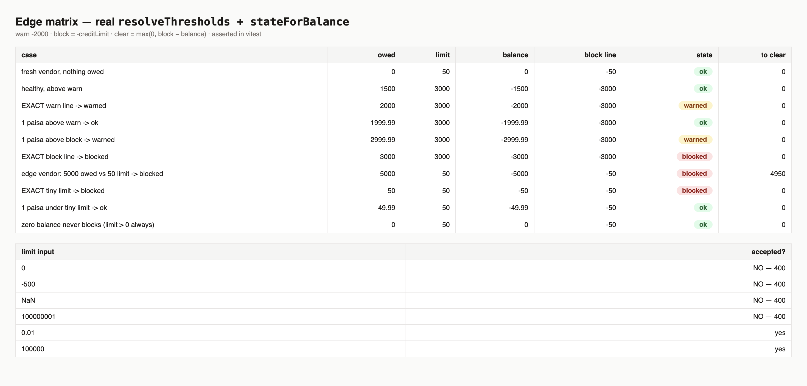

# Credit Limit — Edge Cases (live test, 2026-09-15, updated: usage bar + fix verified)

Throwaway vendors (limit Rs. 50). All test rows deleted after each cycle — 0 remnants.

## Results

| # | Edge | Expected | Got | Status |
|---|------|----------|-----|--------|
| 1 | Usage decreases credit | Delivered Rs. 5,000 / COD 0 → balance −5,000, `blocked`, clear Rs. 4,950 | Same, live on both UIs | PASS |
| 2 | Credit finished → new order | Refused 403 `VENDOR_BILLING_BLOCKED` | Inline refusal: *"pay at least Rs. 4,950…"* | PASS |
| 3 | Pending claim unblocks | No — only `verified` counts | Still `blocked`, *"not yet reflected above"* | PASS |
| 4 | Verified payment unblocks | Balance rises, block lifts at once | Same, same breath | PASS |
| 5 | Pay exactly the old suggestion | Stays `blocked` (−50 = inclusive line) | Same — quirk confirmed live | PASS* |
| 6 | Exact warn / block lines | `warned` @ −2000, `blocked` @ −3000; 1p above → lighter | Asserted vs real functions | PASS |
| 7 | Zero balance, tiny limit | Never blocked (limit > 0) | `ok` | PASS |
| 8 | Bad limit inputs (0/neg/NaN/>100M) | 400 rejected | 400 rejected | PASS |
| 9 | Usage bar (vendor + admin) | Bar + "Rs. X of Rs. Y used · Z%" on both | Vendor card + admin CREDIT LIMIT cell, `role=progressbar` | PASS |
| 10 | Suggestion unblocks in 1 payment | Banner suggests clear + Rs. 0.01 | Rs. 4,950.01 filed → verified → −49.99 → `ok` | PASS |

\* #5 is correct enforcement; the UX fix (banner now suggests +Rs. 0.01, #10) resolves it.

## Proof (side-by-side)

**Blocked → order refused.** Vendor banner vs same vendor's refused submit.

**Claim edges (before fix).** Pending ≠ paid; exact-line payment still blocked.

**New usage UI.** Left: blocked vendor — usage bar *"Rs. 5,000.00 of Rs. 50.00 used · 100%"* + corrected *"Pay at least Rs. 4,950.01"*. Right: admin table with per-row usage bars (edge vendor at −49.99 / `ok` right after the fix-verifying payment — the bar renders in every state).

**Fix proof.** Rs. 4,950.01 verified → balance −49.99 → `ok`, no banner. Rules matrix from the real functions.

## What changed (this update)

- `client/src/utils/creditUsage.ts` + `components/CreditUsageBar.tsx` (new): owed, usage %, pay-to-clear (+Rs. 0.01).
- `VendorBilling.tsx`, `BillingStatusBanner.tsx`, `BillingManagement.tsx`: usage bar everywhere the limit appears; banners/suggestions use the corrected figure.
- `npm run build` passes. Test vendors cleaned (0 remnants).
