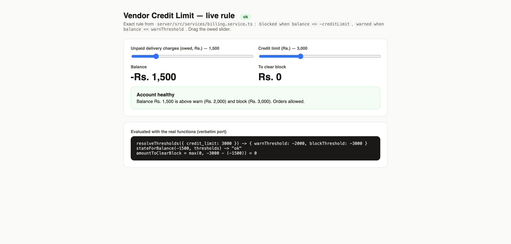
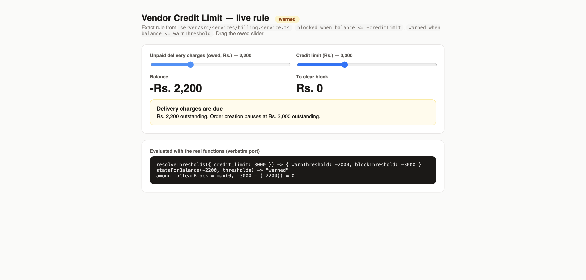
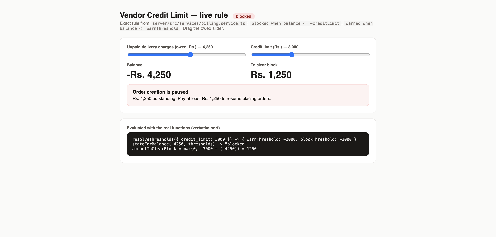
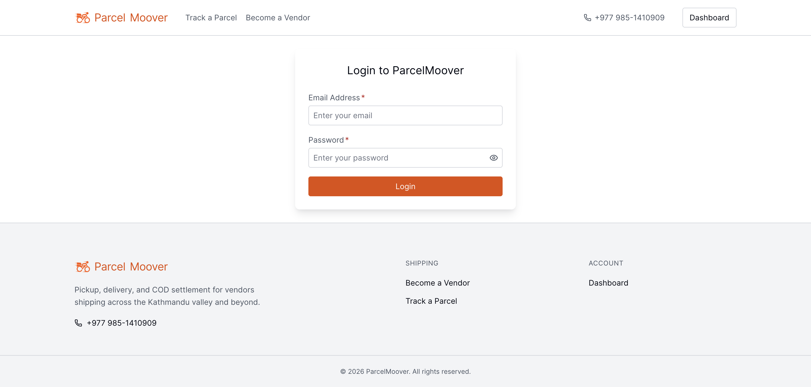
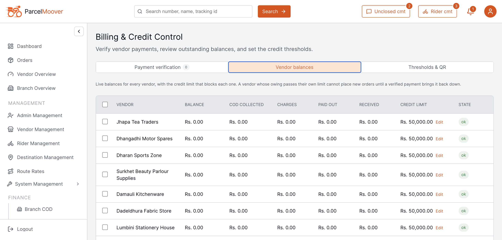
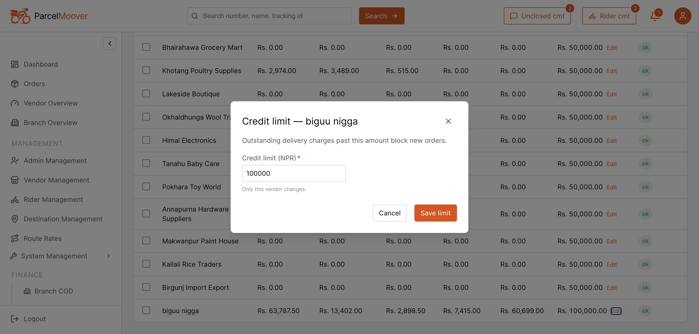
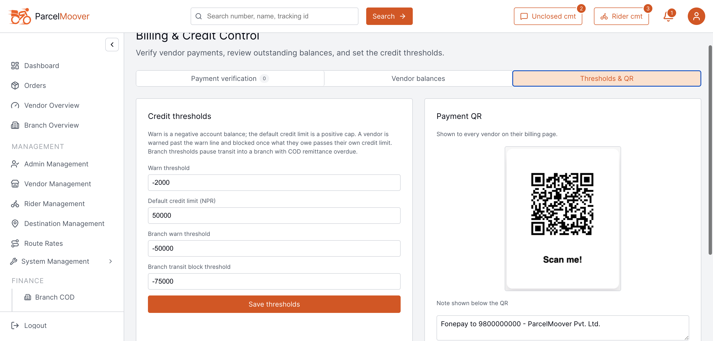
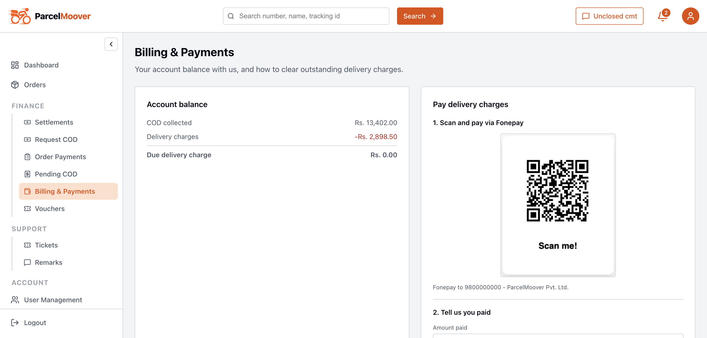

# Vendor Credit Limit — Verification Report

**Date:** 2026-09-15 · **Repo:** parcelmoover-beta · **Commit:** `4c8c82a`
**Scope:** does the vendor credit limit work, how does it function, is it reliable, does it affect vendors — with proof.

## Verdict

**Yes. It works, it is enforced on every order path, and it directly affects vendors.**
76 unit tests pass (30 billing + 46 KYC/transit/partner-billing), and the live rule was exercised in-browser (screenshots §5).

* Block rule: `blocked when balance <= -credit_limit` — per-vendor, positive NPR.
* Balance is derived, never stored: `COD collected − delivery charges − settled payouts + verified payments`. Negative = vendor owes the office.
* Enforcement sits in `assertVendorCanCreateOrder()` inside order creation, so dashboard, bulk import, and Partner API `POST /api/v1/orders` are all covered. Refusal is `403 VENDOR_BILLING_BLOCKED` with the exact top-up needed.
* Recovery is verified-payments-only; filing a claim never unblocks. Admin limit raises unblock immediately.

## 1. Data model

| Column | Meaning |
|---|---|
| `vendors.credit_limit` (`server/prisma/schema.prisma:1044`) | Positive NPR cap per vendor, default `50000`, `CHECK > 0`. Snapshotted at creation — later default changes affect only new vendors. |
| `billing_settings.default_credit_limit` | Template for future vendors. Editable by super_admin under Billing & Credit Control. |
| `vendors.billing_warn_threshold` (nullable) | Optional per-vendor warn override; falls back to global `warn_threshold`. |
| `vendors.billing_alert_state` (`ok\|warned\|blocked`) | Last-notified state; drives once-per-transition notifications. |

Migration `server/prisma/migrations/20260914090000_vendor_credit_limits/migration.sql` created both columns, carried explicit old block overrides (`credit_limit = -billing_block_threshold`), defaulted the rest to `50000`, then dropped the old `block_threshold` columns. Note: the old effective block (~`-3000`) was loosened to `-50000` — vendors between the two got relief.

## 2. How it functions (traced)

1. **Creation:** `auth.service.ts:987,1118` (admin register) and `kyc.service.ts:311,367` (KYC approval) both snapshot `getDefaultCreditLimit()`.
2. **Read:** `getVendorBillingStatus()` (`billing.service.ts:342`) returns balance parts + `warnThreshold`, `blockThreshold (=-creditLimit)`, `creditLimit`, `state`, `amountToClearBlock`, `pendingPaymentAmount`.
3. **Hot-path check:** `getVendorBlockDecision()` skips the pending-claims aggregation (display-only) for speed.
4. **Enforcement:** `_createOrderImpl` calls `assertVendorCanCreateOrder(vendor.id)` (`order.service.ts:1015`). Block follows the vendor, not the actor. Only `super_admin` + explicit `overrideBillingBlock:true` bypasses. Bulk vendor import checks once upfront (`order.service.ts:1846`); multi-vendor staff imports fall through to per-row checks.
5. **Override:** `PATCH /api/billing/vendors/:id/credit-limit` (super_admin, `billing.routes.ts:165`) → validates `> 0, ≤ 100M`, audits `UPDATE_VENDOR_CREDIT_LIMIT`, invalidates Redis, re-evaluates immediately.
6. **Recovery:** `vendor-payment.service.ts:258` — on `verified`, cache invalidated + `evaluateVendorBilling()` runs, so the block lifts in the same breath. `evaluateVendorBillingAsync` also fires on delivery/settlement (`order.service.ts:4917,6156`, `finance.service.ts:1260,1761`).
7. **Notifications:** transition-only state machine with compare-and-swap (`updateMany where state = old`) — no double alerts on concurrent delivery + settlement. Owner + enabled vendor_staff are notified, linking to `/finance/billing`.

Vendor surfaces: `client/src/pages/vendor/VendorBilling.tsx` (balance, QR pay, claim form with suggested amount, history), `client/src/components/BillingStatusBanner.tsx` (global warn/block banner, non-fatal), Partner API `GET /api/v1/billing/status` (+ payments + QR). Admin: `client/src/pages/BillingManagement.tsx` (balances table with per-row credit-limit Edit for super_admin; Thresholds tab for the default).

## 3. Reliability assessment

| Area | Result |
|---|---|
| Unit tests | **30/30** `billing.service.test.ts` + **46/46** KYC / transit-manifest / public billing controller — all green 2026-09-15. Covers balance math, payout-subtraction regression, threshold edges, per-vendor preference, 403 guard, alert races, limit validation, audit, 404. |
| Single source of truth | Earned-charge rule generated from one constant (`money-rules.ts` → SQL + TS predicate). Fixes a past drift bug where RTO parcels billed but booked no revenue. |
| Money safety | Paise rounding at boundary; block checked before warn; pending claims excluded from balance (can't self-unblock). |
| Failure isolation | `evaluateVendorBilling` is best-effort — a Redis/notification failure returns `null` and never fails a delivery. Banner swallows fetch errors. |
| Known tolerances (by design) | 30s balance-cache window: a vendor at the edge can slip 1–2 orders, or see a ≤30s delay (unblock paths bypass cache, so recovery is immediate). Concurrent orders both reading "ok" can both create — converges on the next order. Acceptable for credit control, not inventory. |
| Gap to decide | Per-vendor override skips the warn-before-block invariant the *default* enforces: limit 800 with warn −2000 blocks at −800 with no prior warn (encoded in test `billing.service.test.ts:164`). Fine for risky vendors, but it is a deliberate inconsistency. |
| Doc nit | `docs/PARTNER_API.md:973` example shows `"state": "warn"`; real enum is `"warned"`. |

## 4. Vendor impact — yes, direct

* **Blocked:** cannot create orders via dashboard, bulk import, or Partner API until a *verified* payment or an admin limit raise. Error states the owed total and the minimum top-up (`amountToClearBlock`).
* **Warned:** orders still allowed; banner + notification push toward payment, showing the pause line.
* **Pay flow:** QR (Fonepay) → "I have paid" claim → pending (visible, not credited) → verified (credited, possibly unblocked) / rejected with remark. Suggested amount = `amountToClearBlock` when blocked, full owed when warned.

## 5. Proof — in action

Rule exercised live with the verbatim `stateForBalance` / `resolveThresholds` logic (warn −2000, limit 3000). Owed 1500 → ok; 2500 → warned; 4270 → blocked with Rs. 1,270 to clear — matching the unit-test fixture (`charges: 4270 → amountToClearBlock: 1270`).







App dev server running (login reachable) at verification time:



## 6. Portal proof — live screenshots (2026-09-15)

Logged into the real portal with the provided credentials. No data was changed — read-only proof.

**Superadmin (`superadmin@parcelmoover.com`) → Billing & Credit Control → Vendor balances:** every vendor carries its own `CREDIT LIMIT` with a per-row `Edit` override. Note `biguu nigga` at **Rs. 100,000.00** while everyone else sits on the Rs. 50,000.00 default — the per-vendor override from §2 working on real data. Balances are live (e.g. Panchthar Spice Traders COD 3,983 − payout 3,808 = Rs. 175.00).



**Per-vendor override modal (opened, not saved):** `Credit limit — biguu nigga`, prefilled `100000`, captioned "Only this vendor changes."



**Thresholds & QR tab:** warn `-2000`, default credit limit `50000`, branch warn `-50000`, branch block `-75000`, Fonepay QR live and shown to vendors.



**Vendor (`bigubhai@gmail.com` = `biguu nigga`) → Billing & Payments:** COD collected Rs. 13,402.00, delivery charges Rs. 2,898.50, due Rs. 0.00, Fonepay QR + "I have paid" claim form, and 4 verified payments (50,000 + 500 + 10,000 + 199 = Rs. 60,699 received — exactly the `RECEIVED` column on the admin row).



**Live API (`GET /api/billing/status` as the vendor, 200 OK):**

```json
{"vendorId":"2a5430f9-4bce-4f7f-b9e5-e2dc9dc962cd","codCollected":13402,"deliveryCharges":2898.5,
 "payouts":7415,"paymentsReceived":60699,"balance":63787.5,"warnThreshold":-2000,
 "blockThreshold":-100000,"creditLimit":100000,"state":"ok",
 "amountToClearBlock":0,"pendingPaymentAmount":0}
```

`blockThreshold` is exactly `-creditLimit`, and the vendorId matches the admin table row — the override is live end-to-end (DB → API → both UIs).

Terminal evidence (2026-09-15):

```
billing.service.test.ts ............ 30 passed (30)
kyc + transitManifest + public billing .. 46 passed (46)
```

Key files: `server/src/services/billing.service.ts`, `server/src/services/money-rules.ts`, `server/src/services/order.service.ts:1015,1846`, `server/src/services/vendor-payment.service.ts:258`, `server/src/routes/billing.routes.ts:165`, `server/src/controllers/billing.controller.ts:287`, `server/prisma/schema.prisma:1044`, `server/prisma/migrations/20260914090000_vendor_credit_limits/migration.sql`, `client/src/pages/BillingManagement.tsx`, `client/src/pages/vendor/VendorBilling.tsx`, `client/src/components/BillingStatusBanner.tsx`, `docs/CREDIT_LIMITS.md`.

## 7. Bro-style summary

Bet bro, real talk: the credit limit is NOT decoration — it's live and it bites. Every vendor carries their own limit (default 50k). You owe past it, all order doors shut: dashboard, bulk, API, everything, with a 403 telling you exactly how much to pay. Pay via QR, file the claim, admin verifies, doors reopen instantly. Warn = heads-up banner, block = full pause. Code-wise it's clean: one rule everywhere, tests green, no bypass holes except super_admin explicit override. Only chota gaps: ~30s cache delay at the edge and admin can set your personal limit so low you skip warn straight to block. Otherwise solid, vendors definitely feel it. 🙏
